<h2>TensorFlow-FlexUNet-Image-Segmentation-OAI-Knee-Osteoarthritis-Canny-Edge-Two-Classes (2026/10/08)</h2>
<h3>
OAI-Knee-Osteoarthritis-Edge-Two-Classes: Canny Edge Pseudo Masks Segmentation Challenge
</h3>
Sarah T. Arai 
Software Laboratory antillia.com  
This is the first experiment in Image Segmentation for 
<a href="https://nda.nih.gov/oai"><b>The Osteoarthritis Initiative(OAI)</b></a> 
<b>Knee Osteoarthritis Canny Edge Detection Four Classes</b>
 based on
our <a href="https://github.com/sarah-antillia/TensorFlow-FlexUNet-Image-Segmentation-Model">TensorFlowFlexUNet Model</a>
 (<b>TensorFlow Flexible UNet Image Segmentation Model for Multiclass</b>) and a 256x256-pixel upscaled PNG
 <a href="https://drive.google.com/file/d/1_f6oKZl9klShbVibpVljYGHSBaSS12Qu/view?usp=sharing">
OAI-Knee-Osteoarthritis-Canny-Edge-Two-Classes-ImageMask-Dataset.zip</a> with colorized masks 
(<a href="https://creativecommons.org/licenses/by/4.0/">CC BY 4.0</a>),  
which was derived by us from the following dataset: 
  
<a href="https://www.kaggle.com/datasets/chauvvan/the-osteoarthritis-initiativeoai">
<b>The Osteoarthritis Initiative(OAI)</b>
</a>  by CITIVAN.
 
 
In this experiment, we aggregated the data originally categorized into four classes 
(Doubtful, Mild, Moderate, and Severe) into two classes (<b>Doubtful_or_Mild</b> and <b>Moderate_or_Severe</b>) 
for simplicity.
For the four classes case, please refer to our experiment 
<a href="https://github.com/sarah-antillia/TensorFlow-FlexUNet-Image-Segmentation-OAI-Knee-Osteoarthritis-Canny-Edge-Detection">
TensorFlow-FlexUNet-Image-Segmentation-OAI-Knee-Osteoarthritis-Canny-Edge-Detection</a>
  

<b>Actual Image Segmentation for OAI Knee Canny Edge Two Classes Images of 256x256 pixels</b> 
As shown below, the inferred masks resemble the ground-truth masks.  
 
<b>class_color_map = {Doubtful_or_Mild: green, Moderate_or_Severe: dark_red)} </b>  
<table>
<tr>
<th width="320" height="auto">Input: image</th>
<th width="320" height="auto">Mask (ground_truth)</th>
<th width="320" height="auto">Prediction: inferred_mask</th>
</tr>
<tr>
<td>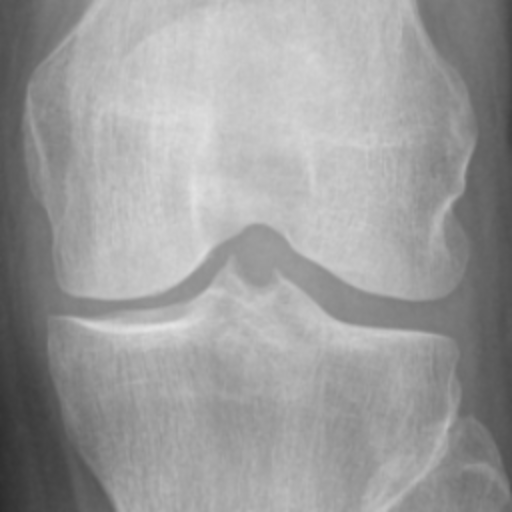</td>
<td>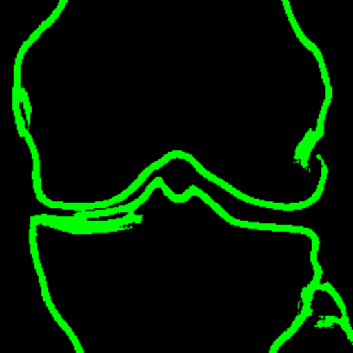</td>
<td>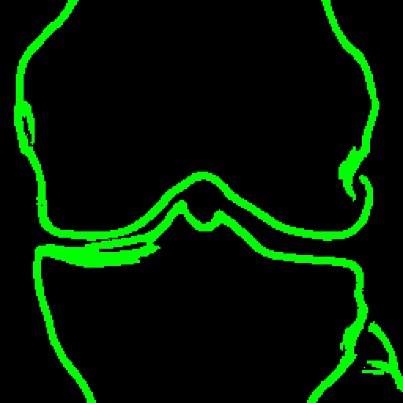</td>
</tr>
<tr>
<td>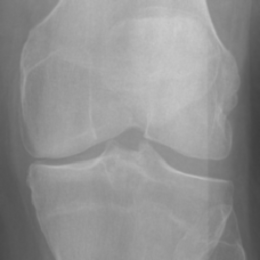</td>
<td>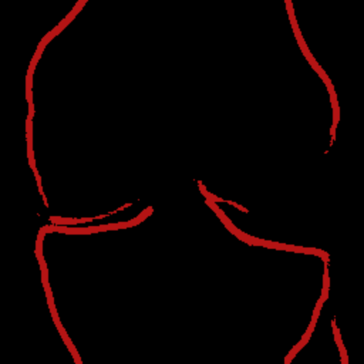</td>
<td>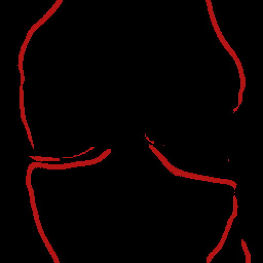</td>
</tr>
<tr>
<td>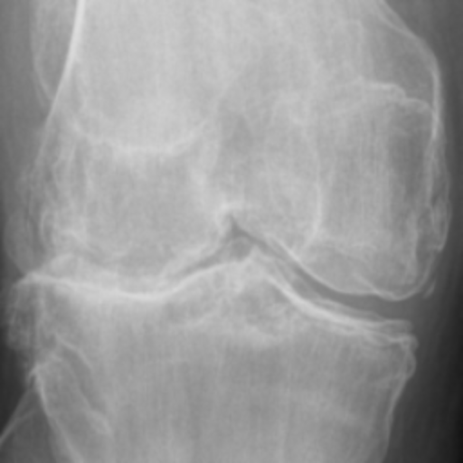</td>
<td></td>
<td></td>
</tr>
</table>
 

 
<h3>1. Dataset Citation</h3>
The dataset used here was derived from the following two datasets on the Kaggle website.
  
<a href="https://www.kaggle.com/datasets/chauvvan/the-osteoarthritis-initiativeoai">
<b>The Osteoarthritis Initiative(OAI)</b>
</a>
 by CITIVAN.
  
For more information, please refer to 
<a href="https://github.com/openmedlab/Awesome-Medical-Dataset/blob/main/resources/KneeOsteoarthritis.md">
Knee Osteoarthritis Dataset with Severity Grading</a>.
  
The following explanation (excerpt) was taken from the website above.
  
<b>Dataset Information</b> 
This article introduces a dataset containing knee joint X-ray data used for knee joint detection and grading according 
to the Kellgren–Lawrence (KL) grading system. The dataset comprises 9,786 knee joint images categorized into five 
severity levels based on the KL system: 0 (healthy), 1 (doubtful), 2 (mild), 3 (moderate), and 4 (severe). 
All images have a resolution of 224 × 224 pixels. Approximately 40% of the dataset images belong to the healthy category, 18% are classified as doubtful, 26% as mild, 13% as moderate, and slightly over 3% as severe.
  
Knee Osteoarthritis (KOA) is one of the most common diseases among older adults, caused by the wearing down of 
the articular cartilage in knee joints. The accuracy of severity diagnosis significantly depends on the clinician's 
diligence and experience. The low reliability of clinicians' grading is attributed to the very subtle differences 
between X-ray images of adjacent grades. Detection and diagnosis of KOA is one of the fields where Deep Learning (DL) 
technology is applied. After training, data is fed into models that predict the severity of KOA based on the KL 
grading system. The high prevalence of KOA necessitates an accurate, reliable, 
and automated severity classification system, and deep learning offers one such solution.
  
<b>Citation</b> 
<pre>
Chen, Pingjun (2018), “Knee Osteoarthritis Severity Grading Dataset”, Mendeley Data, V1, 
doi: 10.17632/56rmx5bjcr.1
</pre>
 
<b>License</b> 
<a href="https://creativecommons.org/licenses/by/4.0/">CC BY 4.0</a> 
Please refer to Official Website: <a href="https://data.mendeley.com/datasets/56rmx5bjcr/1">
Knee Osteoarthritis Severity Grading Dataset</a>
 
 
<h3>
2. ImageMask-Dataset
</h3>
<h3>2.1 Download ImageMask Dataset</h3>
 If you would like to train this <b>OAI Knee Osteoarthritis Canny Edge Detection</b> Segmentation model,
 please download the dataset from Google Drive  
 <a href="https://drive.google.com/file/d/1_f6oKZl9klShbVibpVljYGHSBaSS12Qu/view?usp=sharing">
OAI-Knee-Osteoarthritis-Canny-Edge-Two-Classes-ImageMask-Dataset</a>
(<a href="https://creativecommons.org/licenses/by/4.0/">CC BY 4.0</a>).
Expand the downloaded and put it under the <b>./dataset</b> folder.
 
<pre>
./dataset
└─OAI-Knee-Canny-Edge-Two-Classes
    ├─test
    │   ├─images
    │   └─masks
    ├─train
    │   ├─images
    │   └─masks
    └─valid
         ├─images
         └─masks
</pre>
 
<b>OAI-Knee-Canny-Edge-Two-Classes Statistics</b> 
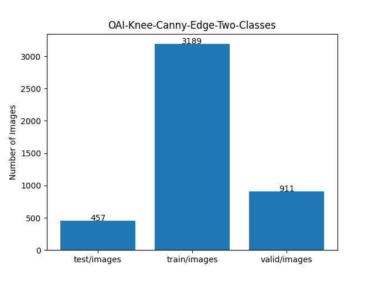 
 
As shown above, the number of images in the training and valid datasets is large enough to use for the
 training set of our segmentation model.
 
<h3>2.2 Derivation of ImageMask Dataset</h3>
The folder structure of our <b>OAI-Images</b> derived from the original dataet excluded <b>Normal</b> is as follows,
but it contains no annotation (mask) files.
 
<pre>
./OAI-Knee-Osteoarthritis
 └─Images
    │
    ├─Doubtful  (1,495 files)
    │   ├─9000622L.png
...
    │   └─9999878L.png
    │    
    ├─Mild      (2,175 files)
    │   ├─9000099R.png
...
    │   └─9999878R.png
    │
    ├─Moderate  (1,086 files)
    │   ├─9000099L.png
...
    │   └─9999510L.png
    │
    └─Severe    (  251 file)
        ├─9012867R.png
...
        └─9997856L.png
</pre>
It consists of four grades of image data: Doubtful, Mild, Moderate, and Severe. 
However, a class-imbalance problem clearly occurs because the number of Severe images is small compared to the other classes.
  
<b>Step 1</b> 
We generated a 256x256-pixel upscaled master image dataset from the original 244x244-pixel PNG files in subfolders of <b>Images</b>.
  
<b>Step 2</b> 
We generated the Canny edge pseudo masks by applying the classic 
<a href="https://docs.opencv.org/5.0/py_tutorials/py_imgproc/py_canny/py_canny.html">
<b>Canny Edge Detection</b> </a> to all master images.
  
<b>Step 3</b> 
We generated the first <b>OAI-Knee-Osteoarthritis-Canny-Edge-Two-Classes-ImageMask-Dataset</b> 
from all pairs of the master images and their corresponding Canny edge pseudo masks by using a
simple Python script <a href="https://github.com/sarah-antillia/TensorFlow-FlexUNet-Image-Segmentation-OAI-Knee-Osteoarthritis-Canny-Edge-Detection/blob/main/generator/ImageMaskDatasetGenerator.py">
ImageMaskDatasetGenerator.py
</a>. Furthermore to address the class imbalance problem, we used an offline augmentation 
tool to flip horizontally and vertically the Severe images. 
  
<b>Step 4</b> 
We generated a pretrained FlexUNet Segmentation Model by using the first <b>OAI-Knee-Osteoarthritis-Canny-Edge-Two-Classes</b> dataset. 
 
<b>Step 5</b> 
We generated the second pseduo masks by applying the segementation (inference) method of the pretrained FlexUNet Model. 
 
<b>Step 6</b> 
We generated curated pseudo masks from the second pseudo masks generated in the previous step by using a 
simple Python script to exclude the inappropriate pseudo masks.  
<b>Step 7</b> 
We finally generated the second 
 <a href="https://drive.google.com/file/d/1_f6oKZl9klShbVibpVljYGHSBaSS12Qu/view?usp=sharing">
OAI-Knee-Osteoarthritis-Canny-Edge-Two-Classes-ImageMask-Dataset</a> 
from all pairs of the master images and their corresponding curated pseudo masks.
  

<h3>2.3 Train Sample Images and Masks</h3>
<b>Train_sample_images</b> 
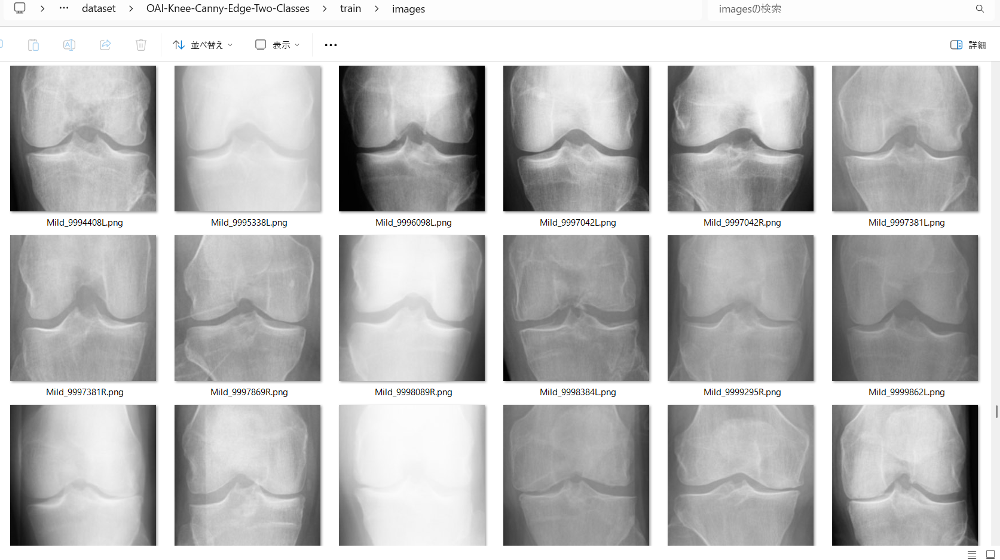
 
<b>Train_sample_masks</b> 
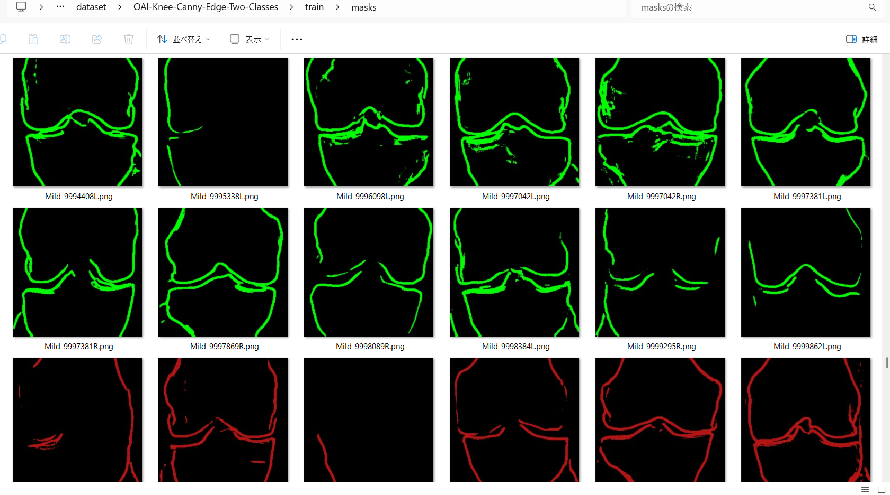
 
<h3>
3. Train TensorFlowFlexUNet Model
</h3>
 We trained the OAI-Knee-Canny-Edge-Two-Classes TensorFlowFlexUNet model using the following
<a href="./projects/TensorFlowFlexUNet/OAI-Knee-Canny-Edge-Two-Classes/train_eval_infer.config"> <b>train_eval_infer.config</b></a> file.  
Please move to ./projects/TensorFlowFlexUNet/OAI-Knee-Canny-Edge-Two-Classes and run the following bat file. 
<pre>
>1.train.bat
</pre>
This runs the following command. 
<pre>
>python ../../../src/TensorFlowFlexUNetTrainer.py ./train_eval_infer.config
</pre>

<b>Model parameters</b> 
Defined a small <b>base_filters=16 </b> and large <b>base_kernels=(9,9)</b> for the first Conv Layer of Encoder Block of 
<a href="./src/TensorFlowFlexUNet.py">TensorFlowFlexUNet.py</a> 
and a large <b>num_layers=8</b> (including a bridge between Encoder and Decoder Blocks).
<pre>
[model]
; You may specify your own UNet class derived from our TensorFlowFlexModel
model         = "TensorFlowFlexUNet"
generator     =  False
image_width    = 256
image_height   = 256
image_channels = 3
num_classes    = 3
base_filters   = 16
base_kernels   = (9,9)
num_layers     = 8
dropout_rate   = 0.04
; Specfied a large dilation.
dilation       = (3,3)
</pre>
<b>Learning rate</b> 
Defined a small learning rate.  
<pre>
[model]
learning_rate  = 0.00007
</pre>
<b>Loss and metrics functions</b> 
Specified "categorical_focal_dice_loss" and <a href="./src/dice_coef_multiclass.py">"dice_coef_hybrid"</a>,
and weight parameters <b>hybrid_alpha</b> and <b>hybrid_beta</b> for <b>dice_coef_hybrid</b> function. 
<pre>
[model]
loss           = "categorical_focal_dice_loss"
metrics        = ["dice_coef_hybrid"]
; Experimental two weight parameters to calculate "dice_coef_hybrid" metric.
hybrid_alpha   = 1.6
hybrid_beta    = 0.4
</pre>
<b>Dataset class</b> 
Specifed <a href="./src/ImageCategorizedMaskDataset.py">ImageCategorizedMaskDataset</a> class. 
<pre>
[dataset]
class_name    = "ImageCategorizedMaskDataset"
</pre>
 
<b>Learning rate reducer callback</b> 
Enabled the learning_rate_reducer callback and a small reducer_patience.
<pre> 
[train]
learning_rate_reducer = True
reducer_factor     = 0.5
reducer_patience   = 4
</pre>
<b>Early stopping callback</b> 
Enabled early stopping callback with the patience parameter.
<pre>
[train]
patience      = 10
</pre>
<b>RGB Color map</b> 
Specified RGB color map dict for OAI-Knee-Canny-Edge-Two-Classes 1+2 classes. 
<pre>
[mask]
mask_datatyoe    = "categorized"
mask_file_format = ".png"
;Knee-X-Ray RGB color map dict for 1+2 classes.
; RGB_COLORS = {"Doubtful_or_Mild": green, "Moderate_or_Severe": dark_red}
rgb_map = {(0,0,0):0,(0,255,0):1, (180,20,20):2}</pre>

<b>Epoch change inference callback</b> 
Enabled <a href="./src/EpochChangeInferencer.py">epoch_change_infer callback</a></b>. 
<pre>
[train]
epoch_change_infer       = True
epoch_change_infer_dir   =  "./epoch_change_infer"
num_infer_images         = 6
</pre>

By using this callback, on every epoch change, the inference procedure can be called
 for 6 images in the <b>mini_test</b> folder. This will help you confirm how the predicted mask changes 
 at each epoch during your training process.  
  
As shown below, early in the model training, the predicted masks from our UNet segmentation model showed 
discouraging results.
 However, as training progressed through the epochs, the predictions gradually improved. 
   
 
<b>Epoch_change_inference output at starting (epoch 1, 2, 3)</b> 
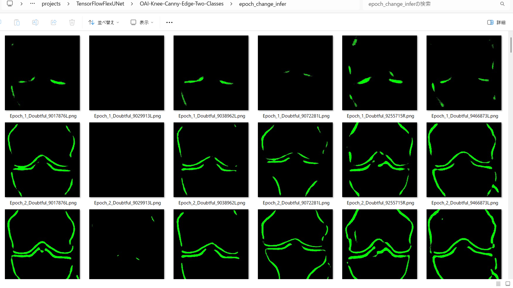 
 
<b>Epoch_change_inference output at middlepoint (epoch 35, 36, 37)</b> 
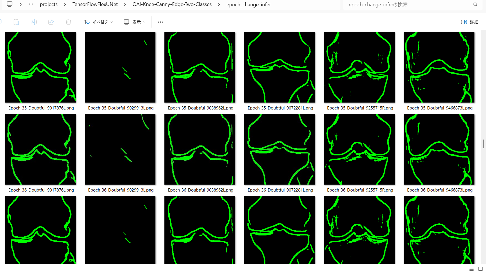 
 
<b>Epoch_change_inference output at ending (epoch 71, 72, 73)</b> 
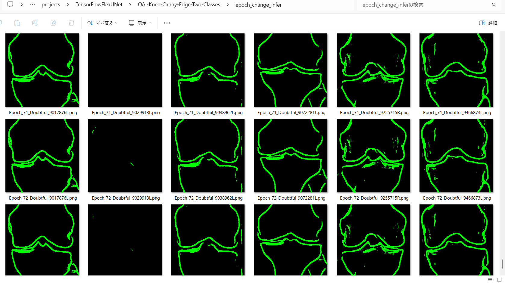 
 
In this experiment, the training process was stopped at epoch 73 by EarlyStoppingCallback. 
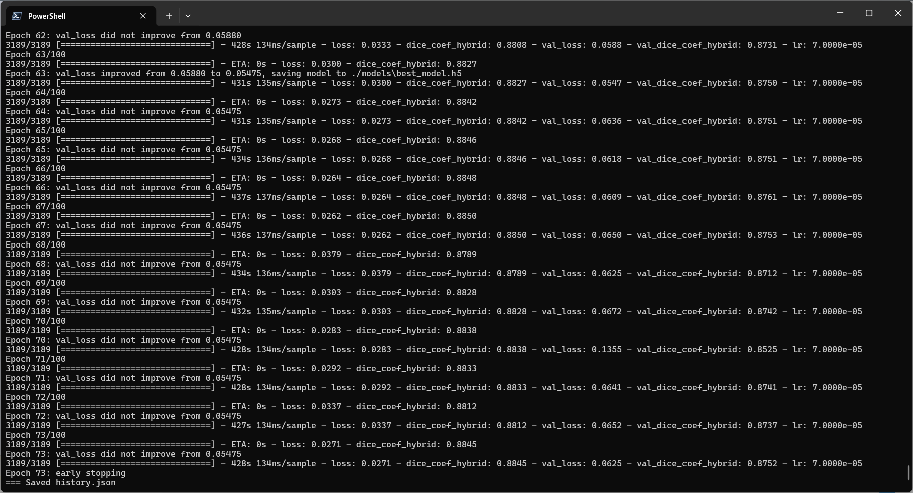 
 
<a href="./projects/TensorFlowFlexUNet/OAI-Knee-Canny-Edge-Two-Classes/eval/train_metrics.csv">train_metrics.csv</a> 
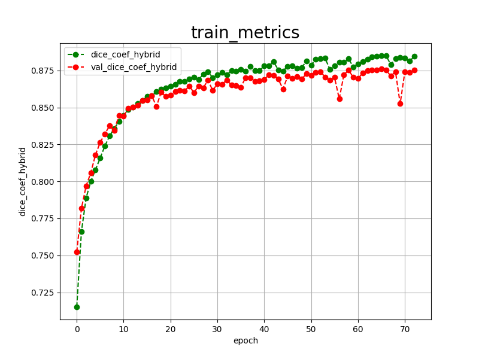 
 
<a href="./projects/TensorFlowFlexUNet/OAI-Knee-Canny-Edge-Two-Classes/eval/train_losses.csv">train_losses.csv</a> 
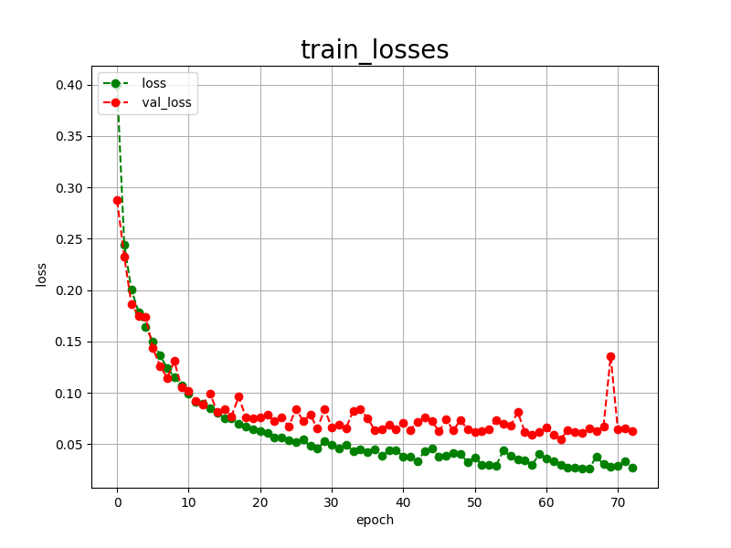 
 
<h3>
4. Evaluation
</h3>
Please move to <b>./projects/TensorFlowFlexUNet/OAI-Knee-Canny-Edge-Two-Classes</b> folder,
and run the following bat file to evaluate the TensorFlowUNet model for OAI-Knee-Canny-Edge-Two-Classes. 
<pre>
>./2.evaluate.bat
</pre>
This runs the following command.
<pre>
>python ../../../src/TensorFlowFlexUNetEvaluator.py ./train_eval_infer_aug.config
</pre>

Evaluation console output: 
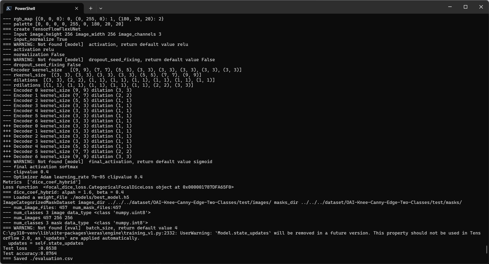
  Image-Segmentation-OAI-Knee-Canny-Edge-Two-Classes
<a href="./projects/TensorFlowFlexUNet/OAI-Knee-Canny-Edge-Two-Classes/evaluation.csv">evaluation.csv</a> 
The loss (categorical_focal_dice_loss) on this OAI-Knee-Canny-Edge-Two-Classes/test was not low, and 
dice_coef_hybrid was not high, as shown below.
 
<pre>
categorical_focal_dice_loss,0.0538
dice_coef_hybrid,0.8764
</pre>
However, these scores are a little bit better than those of the following four classes case 
<a href="https://github.com/sarah-antillia/TensorFlow-FlexUNet-Image-Segmentation-OAI-Knee-Osteoarthritis-Canny-Edge-Detection">
TensorFlow-FlexUNet-Image-Segmentation-OAI-Knee-Osteoarthritis-Canny-Edge-Detection</a>
 
<pre>
categorical_focal_dice_loss,0.0799
dice_coef_hybrid,0.8218
</pre>
 
<h3>
5. Inference
</h3>
Please move to <b>./projects/TensorFlowFlexUNet/OAI-Knee-Canny-Edge-Two-Classes</b> folder
and run the following bat file to infer segmentation regions for images using the trained TensorFlowUNet model for OAI-Knee-Canny-Edge-Two-Classes. 
<pre>
>./3.infer.bat
</pre>
This runs the following command.
<pre>
>python ../../../src/TensorFlowFlexUNetInferencer.py ./train_eval_infer_aug.config
</pre>

<b>mini_test_images</b> 
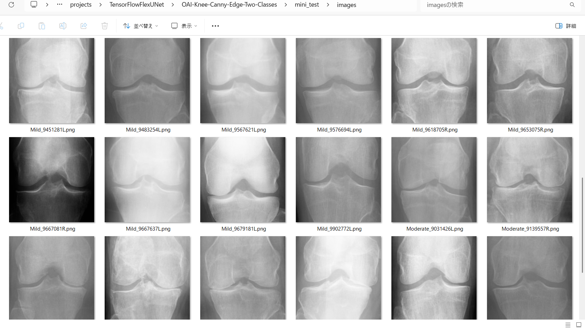 
<b>mini_test_mask(ground_truth)</b> 
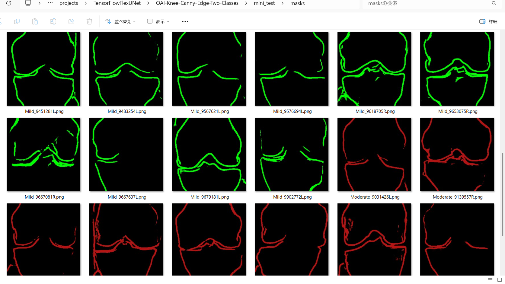 

<b>Inferred test masks</b> 
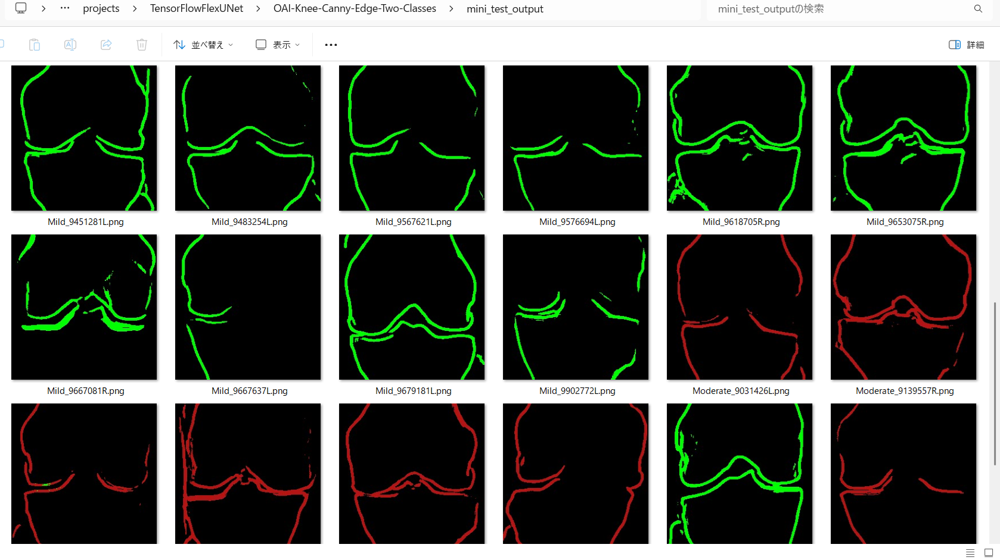 
 

<b>Enlarged images and masks for OAI Knee Canny Edge Detection Images of 256x256 pixels</b> 
As shown below, the inferred masks look similar to the ground truth masks except for the second and fourth cases. 
 
<b>class_color_map = {Doubtful_or_Mild: green, Moderate_or_Severe: dark_red)} </b>  
<table>
<tr>
<th width="320" height="auto">Image</th>
<th width="320" height="auto">Mask (ground_truth)</th>
<th width="320" height="auto">Inferred-mask</th>
</tr>
<tr>
<td>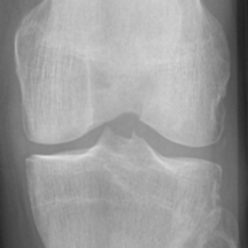</td>
<td>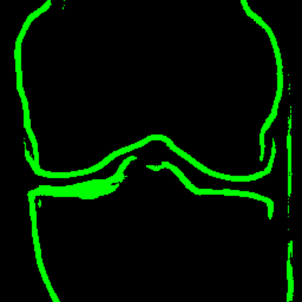</td>
<td>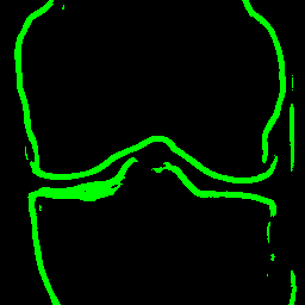</td>
</tr>
<tr>
<td>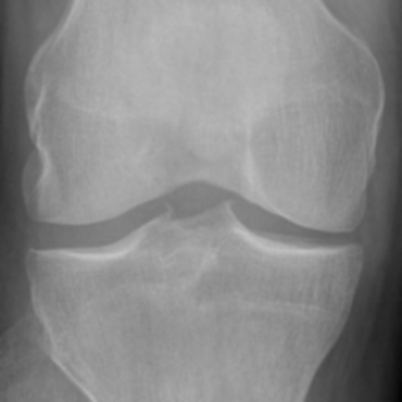</td>
<td>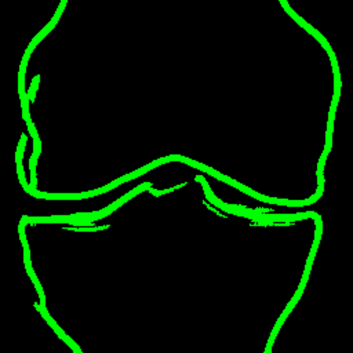</td>
<td></td>
</tr>
<tr>
<td>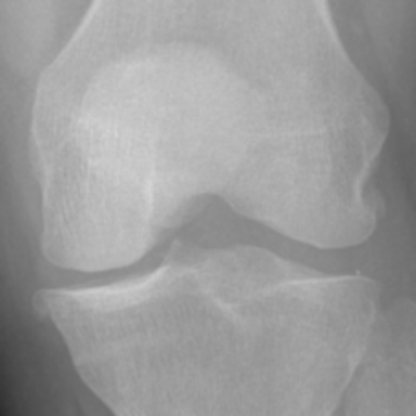</td>
<td>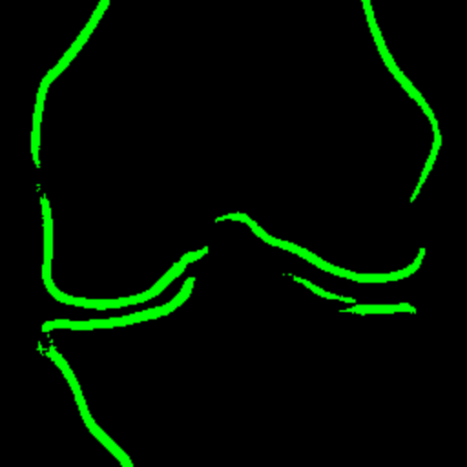</td>
<td>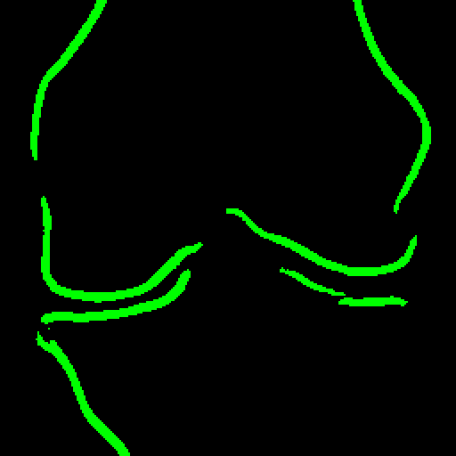</td>
</tr>
<tr>
<td>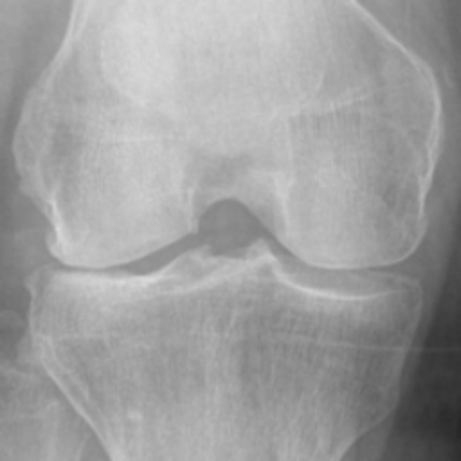</td>
<td>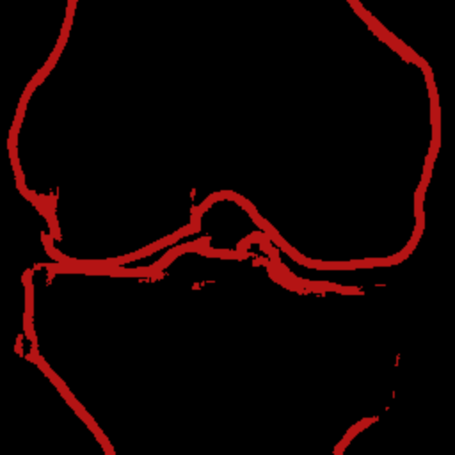</td>
<td>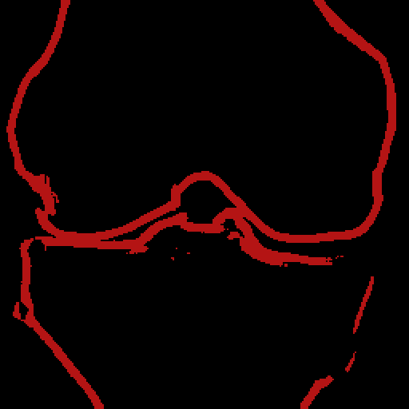</td>
</tr>
<tr>
<td></td>
<td></td>
<td></td>
</tr>
<tr>
<td>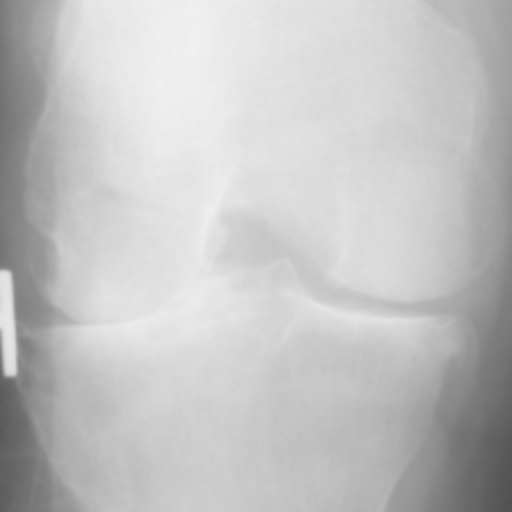</td>
<td></td>
<td></td>
</tr>
</table>

 
<h3>
References
</h3>
<b>1. THE OSTEOARTHRITIS INITIATIVE</b> 
PROTOCOL FOR THE COHORT STUDY 
Michael C. Nevitt, PhD; David T. Felson, MD; Gayle Lester, PhD  
<a href="https://nda.nih.gov/static/docs/StudyDesignProtocolAndAppendices.pdf">
https://nda.nih.gov/static/docs/StudyDesignProtocolAndAppendices.pdf
</a>
  
<b>2. The 4 Stages of Knee Arthritis: What Your Grade Means (With X-Rays)</b> 
Dr. Cory Calendine, MD 
<a href="https://corycalendinemd.com/blog/knee-arthritis-x-ray-grades/">
https://corycalendinemd.com/blog/knee-arthritis-x-ray-grades/
</a>
  
<b>3. Automatic knee osteoarthritis severity grading based on X-ray images using a hierarchical classification method</b> 
Jian Pan, Yuangang Wu, Zhenchao Tang, Kaibo Sun, Mingyang Li, Jiayu Sun, Jiangang Liu, Jie Tian, Bin Shen 
 
<a href="https://pmc.ncbi.nlm.nih.gov/articles/PMC11571664/">https://pmc.ncbi.nlm.nih.gov/articles/PMC11571664/</a>
  
<b>4. Ensemble deep-learning networks for automated osteoarthritis grading in knee X-ray images</b> 
Sun-Woo Pi, Byoung-Dai Lee, Mu Sook Lee & Hae Jeong Lee  
<a href="https://www.nature.com/articles/s41598-023-50210-4">https://www.nature.com/articles/s41598-023-50210-4</a>
  
<b>5. TensorFlow-FlexUNet-Image-Segmentation-OAI-Knee-Osteoarthritis-Edge-Detection </b> 
Toshiyuki Arai 
<a href="https://github.com/sarah-antillia/TensorFlow-FlexUNet-Image-Segmentation-OAI-Knee-Osteoarthritis-Edge-Detection">
https://github.com/sarah-antillia/TensorFlow-FlexUNet-Image-Segmentation-OAI-Knee-Osteoarthritis-Edge-Detection
</a>
  
<b>6. TensorFlow-FlexUNet-Image-Segmentation-X-Ray-Knee-Two-Classes-Edge-Detection </b> 
Toshiyuki Arai 
<a href="https://github.com/sarah-antillia/TensorFlow-FlexUNet-Image-Segmentation-Knee-X-Ray-Two-Classes-Edge-Detection">
https://github.com/sarah-antillia/TensorFlow-FlexUNet-Image-Segmentation-Knee-X-Ray-Two-Classes-Edge-Detection
</a>
  
<b>7. TensorFlow-FlexUNet-Image-Segmentation-Knee-X-Ray-Edge-Detection </b> 
Toshiyuki Arai 
<a href="https://github.com/sarah-antillia/TensorFlow-FlexUNet-Image-Segmentation-Knee-X-Ray-Edge-Detection">
https://github.com/sarah-antillia/TensorFlow-FlexUNet-Image-Segmentation-Knee-X-Ray-Edge-Detection
</a>
  
<b>8. TensorFlow-FlexUNet-Image-Segmentation-Model</b> 
Toshiyuki Arai 
<a href="https://github.com/sarah-antillia/TensorFlow-FlexUNet-Image-Segmentation-Model">
https://github.com/sarah-antillia/TensorFlow-FlexUNet-Image-Segmentation-Model
</a>
  

